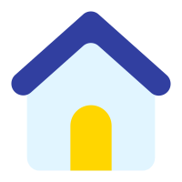
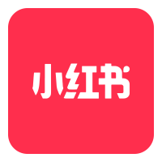

# Hi there 👋

- 🌱 I’m currently learning Mathemetics & Computer Science
- 👯 I’m looking to collaborate on **Responsible AI**, **NLP** and **HCI** and any other interesting things
- 📫 You can connect me through [LinkedIn](https://www.linkedin.com/in/jinxiang-xie/)
- 🏠 HomePage: [Richard's Secret Cabin](jxtse.github.io)

  
  
  

<!--
**jxTse/jxTse** is a ✨ _special_ ✨ repository because its `README.md` (this file) appears on your GitHub profile.

Here are some ideas to get you started:

- 🌱 I’m currently learning mathemetics & computer science
- 👯 I’m looking to collaborate on AIGC and any other interesting things
- 🤔 I’m looking for help with ...
- 💬 Ask me about ...
- 📫 How to reach me: jxTse@outlook.com
- 😄 Pronouns: ...
- ⚡ Fun fact: ...
-->
